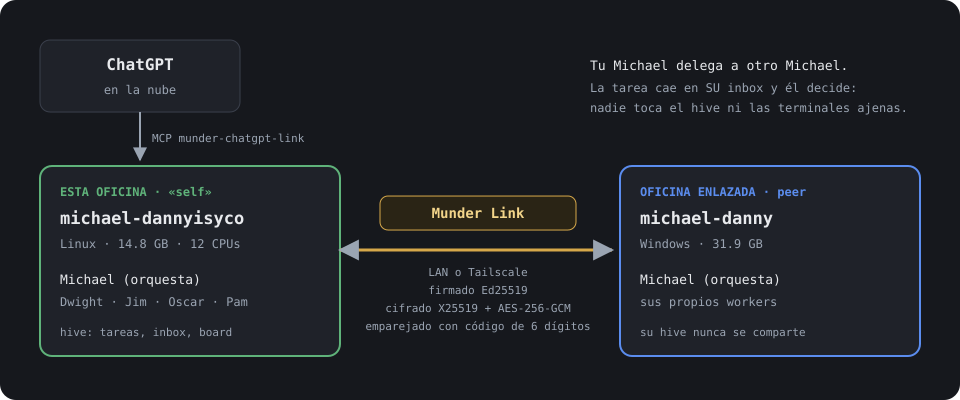

<div align="center">


# Munder Difflin — Fork ISyCo

### Una oficina de agentes en tu máquina, y otra en la de al lado, trabajando juntas

[](https://github.com/DannyBaanks/munder-difflin/actions/workflows/ci.yml)
[](https://github.com/DannyBaanks/munder-difflin/releases)
[](https://github.com/DannyBaanks/munder-difflin/actions/workflows/ci.yml)
[](./LICENSE)

</div>

<p align="center">
  
</p>

> Fork en español de [chaitanyagiri/munder-difflin](https://github.com/chaitanyagiri/munder-difflin) (al día con su 0.5.2).
> Este repo es [DannyBaanks/munder-difflin](https://github.com/DannyBaanks/munder-difflin).
> El upstream es la app de oficina multi-agente (Electron + terminales reales + hive):
> su producto completo se documenta en su
> [README](https://github.com/chaitanyagiri/munder-difflin/blob/main/README.md),
> [`HIVE.md`](./HIVE.md), [`SPEC.md`](./SPEC.md) y [`DESIGN.md`](./DESIGN.md).
> Aquí solo está **lo que cambia este fork + lo mínimo para correrlo**.

## El comando que viniste a buscar

```bash
./start.sh                 # build compilado, despegado de la terminal (recomendado)
munder start               # dev con hot reload, también despegado (ver abajo)
```

Regla de oro: **nunca los dos a la vez** — comparten
`~/.config/munder-difflin` y la segunda instancia muere por singleton.
Dos sesiones en paralelo: `./start.sh --user-data-dir ~/.config/munder-difflin-harness2`.

Descargas de este fork (Windows `.exe` instalador o portable, Linux `.AppImage`,
con `SHA256SUMS.txt`) en
[releases](https://github.com/DannyBaanks/munder-difflin/releases). El `.dmg` de
mac sigue saliendo del [upstream](https://github.com/chaitanyagiri/munder-difflin/releases/latest).

## Para correrlo (mínimo)

Requisitos: Node.js 18+, toolchain C++ para `node-pty`, y al menos un CLI
de agente en tu `PATH` (`claude` por defecto, o `agy/codex/grok/kimi/gemini/qwen/opencode/crush/pi/copilot/cursor-agent`).

```bash
git clone https://github.com/DannyBaanks/munder-difflin.git
cd munder-difflin
npm install        # postinstall recompila node-pty contra Electron
npm run dev        # o mejor: munder start (siguiente sección)
```

En el primer arranque sale el onboarding; **Add agent** crea tu primera sesión —
el GOD se sienta solo en la oficina de Michael.

## ISyCo Features — lo que añade este fork

### 1. Español primero
Selector de idioma al onboarding (`en/es/zh-CN/ar`). El inglés sigue siendo
el default: nada cambia hasta que eliges en Settings. `es.json` completo,
Title Case, sin artefactos de traducción automática.

### 2. Canal de control local (`127.0.0.1`)
Loopback solo-máquina con token `0600` en userData. `munder ctl ping`,
`GET /salud`, `GET /sesion`, `POST/DELETE /sesion/agentes` y repintado
bajo demanda sin restart. Sin token se rehúsa; nada del puerto sale de la máquina.

### 3. Launcher Linux `./start.sh`
Fix del freeze "Detenido": Electron despegado con `setsid`, stdio a
`~/.local/state/munder-difflin/run-*.log`, sin terminal de control para que el
job control no mande `SIGTSTP`. Reintento GPU→software, guardia singleton por
userData, `--fg` solo debug. Ver `./start.sh --check`.

### 4. Supervisión de entrega (router + breaker)
Si hay outbox encolado y el router murió, el beat de 8s lo rearma y drena
(peor caso ~9.5s, log `router-supervise`). Un evento sin `tool_input`
(Pi bridge, plugin OpenCode) ya no cuenta como loop idéntico; velocity /
error-storm / no-progress siguen intactos.
Ver [`docs/delivery-reliability-decision.md`](./docs/delivery-reliability-decision.md).

### 5. Canvas + terminal Linux
`useCanvasRepaint`: repinta retratos 2D tras la muerte del proceso GPU
(heartbeat 30s + focus/visible). `terminal:openAtFolder` abre tu terminal
(gnome-terminal > ptyxis > konsole > …) en vez del `open -a` de macOS.

### 6. Harness usable + avatar compilado
Botón "create new config" en HivePicker, homes anidados en fresh mode,
`.gitignore` auto en cada home, sesiones paralelas por `--user-data-dir`.
Avatares procedurales compartidos app↔CLI (`composeAvatar`, `AVATAR_VOCAB`):
mismo texto = mismo PNG, sin drift.

<p align="center">
  <br>
  <sub>Salida real de <code>munder avatar compilar</code>: «piel morena, blusa rosa, gafas» ·
  «piel clara, pelo rojo, sudadera verde» · «piel oscura, pelo negro rizado, camisa azul» ·
  «piel clara, pelo largo castaño, blusa morada».</sub>
</p>

### 7. Catálogo + Office Bridge MCP
`modelCatalog.json` con familia `openisy`, `mcpCatalog.ts` con `office-bridge`
(stdio local, `HIVE_ROOT` inyectado): `compose_submit/task_get/task_message/task_cancel/office_status`.
Guía sin rutas personales en [`src/mcp/office-bridge/GUIA.md`](./src/mcp/office-bridge/GUIA.md).

### 8. CLI `munder` — sin `npm run dev`
Yo no arranco con `npm run dev`: el fork trae `tools/munder/munder`
(Node puro, cero dependencias). Instala con
`ln -sf "$PWD/tools/munder/munder" ~/.local/bin/munder`:

```bash
munder start / stop / restart / status / logs -f   # ciclo de vida
munder sesion ver / armar / quitar                 # agentes en vivo
munder ctl ping / repaint                          # canal de control
munder sesion proveedor                            # wizard de CLIs y modelos
munder avatar compilar "piel morena, blusa rosa, gafas"  # PNG 18×28/18×32
munder avatar inspect ./yo.png                     # matriz textual
```

Detalle en [`tools/munder/README.md`](./tools/munder/README.md);
receta para modelos en [`tools/munder/AVATAR_AGENTES.md`](./tools/munder/AVATAR_AGENTES.md).

### 9. Placeholder de worker ("cuerpo prestado")
Tu avatar entra al piso como un worker más: `firstFreeCharacter()` elige el
slot libre (nunca `michael`, que es del GOD) e `injectAvatarAs()` le inyecta
tu receta con cachés invalidadas. Comportamiento y hitbox intactos (la clase
`Character` es genérica); las líneas que dice son las del slot prestado.
Y persiste: `munder avatar inyectar "tu desc" --slot auto` guarda la receta
en `avatar-overrides.json` y la app la aplica al arrancar.

### 10. Munder Link — dos oficinas, un trabajo
Un Michael le delega trabajo al otro por LAN o Tailscale, sin compartir
autoridad interna: el peer nunca toca tu hive ni tus PTYs, deja la tarea en
el inbox de tu Michael (formato Office Bridge) y él decide. Cada llamada va
firmada (Ed25519) y cifrada (X25519 + AES-256-GCM), con anti-replay; el
emparejamiento se confirma con un código de 6 dígitos en ambas pantallas.
En las dos máquinas: `munder link conectar`, o desde la app en
**Configuración → Munder Link** (feature 12). Guía con salida real en
[`tools/munder/LINK.md`](./tools/munder/LINK.md).

<p align="center">
  
</p>

### 11. Fachada ChatGPT sobre Munder Link
ChatGPT (que vive en la nube) opera tu oficina emparejada sin tocar tu red:
un servidor MCP local (`src/mcp/munder-chatgpt-link/`) verifica peer + ruta
(loopback, misma LAN o Tailscale) antes de cada llamada y expone 7 tools
(`verify/peers/status/submit/get/message/cancel`). Todo lo crypto sigue
siendo Munder Link.

**Sabe dónde está parado:** `munder_link_peers` devuelve `self` (la oficina
donde corre el MCP) aparte de `peers` (las enlazadas), y
`munder_office_status("self")` lee esta máquina directo, sin red. Así ChatGPT
nunca confunde «el MCP corre aquí» con «el MCP alcanza esto». Delegar a `self`
responde `self_not_a_peer`: eso viaja a otra oficina. Detalle en
[`src/mcp/munder-chatgpt-link/README.md`](./src/mcp/munder-chatgpt-link/README.md).

**Probado end-to-end (2026-09-25):** chatgpt.com → fachada → link emparejado
× LAN → Michael del otro lado: `compose_submit` llegó `accepted` con recibo
(`task-1790331110686-46d4bbdb`, same_lan vía wlo1, 22ms). Si la oficina remota
tiene su Michael activo, la tarea corre; si no, queda en cola hasta despertar.

Para levantarla en tu máquina: [`chatgpt-tunnel.sh`](./src/mcp/munder-chatgpt-link/chatgpt-tunnel.sh) —
cada quien levanta su propio túnel (tu URL es pública y de vida corta; la mía
jamás te sirve a ti).

### 12. Munder Link desde Configuración
Todo lo del link sin terminal: encender/apagar, ver esta oficina y las
enlazadas (RAM, workers libres, latencia), buscar en tu red o en Tailscale,
emparejar y olvidar. Usa el mismo motor, identidad y pid que `munder link`,
así que lo que prendes en la app lo apagas en la terminal y al revés. La
pantalla nunca maneja llaves: solo un token de un uso que emite el proceso
principal.

<p align="center">
  
</p>

### 13. Guardia del hive + piso de versión de Claude Code
El hive es solo para coordinarse: si un agente intenta escribir con
`Write/Edit/MultiEdit/NotebookEdit` fuera de lo suyo (su `memory.md`, su
inbox/outbox, `tasks.json`; el GOD además `board.md` y `spawn-requests/`), el
hook se lo niega y le dice por qué. Y si pides un modelo más nuevo que tu
Claude Code (Opus 5.5 pide 2.1.280+), arranca con el más nuevo que tu CLI
soporta en vez de que el agente nunca levante.

### 14. Office Packs
Plantillas de oficina listas: `core` más cinco giros (servicios del hogar,
servicios profesionales, restaurante, tienda, SaaS/consultoría).

```bash
munder sesion packs                                   # qué hay
munder sesion armar --pack retail-shop --cwd ~/tienda --solo oscar,pam
```

### 15. Word, Excel, PowerPoint y PDF para los agentes
La base de conocimiento ya no indexa bytes de un `.docx` como si fueran texto:
convierte Word/Excel/PowerPoint/PDF fuera del proceso main y, si un archivo no
se puede leer, lo dice en vez de guardar basura. Los agentes tienen
`doc-text` para leerlos en sus carpetas.

### 16. CI en Linux, Windows y macOS
Cada push compila y corre la suite en los tres sistemas (antes solo macOS, y
en Windows los tests ni arrancaban). Encontró un bug real: en Windows, borrar
un worktree podía seguir el junction de `node_modules` hacia el checkout
principal; hoy un test con un `must-survive.txt` lo vigila.

## Garantías de este fork

* Nada subido al upstream: remoto `fork=DannyBaanks/munder-difflin`.
* Sin llaves en el repo: solo placeholders (`xoxb-...`) en docs y comentarios.
* `avatar-engine.cjs` es GENERATED desde `portraitArt.ts` (verificado por hash
  en la suite); no se edita a mano:
  `node tools/munder/sync-avatar-engine.cjs`.
* Tests: `npm run test:focused` (los mismos en los tres sistemas),
  `node tools/munder/link.test.cjs`, `node tools/munder/avatar.test.cjs`,
  `npm run typecheck`.
* Gate de release: `node tools/check-release-links.cjs --live` comprueba que
  cada descarga anunciada exista de verdad.

## Licencia

Código bajo **MIT** — ver [`LICENSE`](./LICENSE). El pixel-art incluido es
*Modern Interiors - RPG Tileset [16X16]* de
[LimeZu](https://limezu.itch.io/moderninteriors) (licencia Complete Version,
con crédito obligatorio; no cubierto por el MIT) — ver
[`LICENSE-ASSETS`](./LICENSE-ASSETS). Parodia afectuosa, sin afiliación con
NBC, *The Office* ni Dunder Mifflin.
