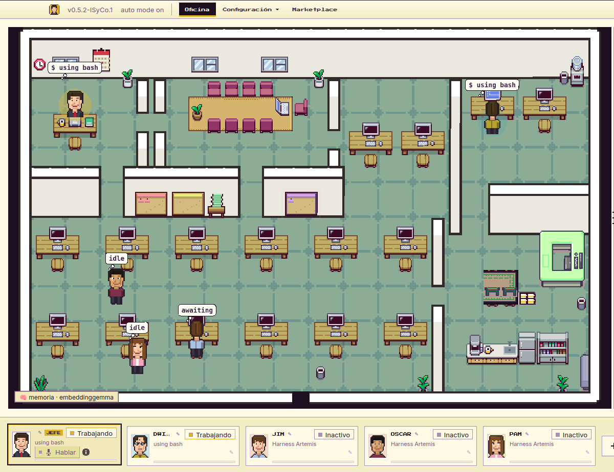
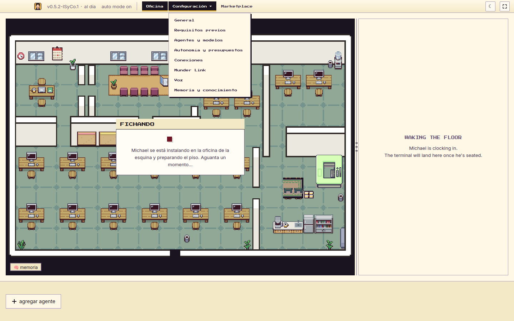
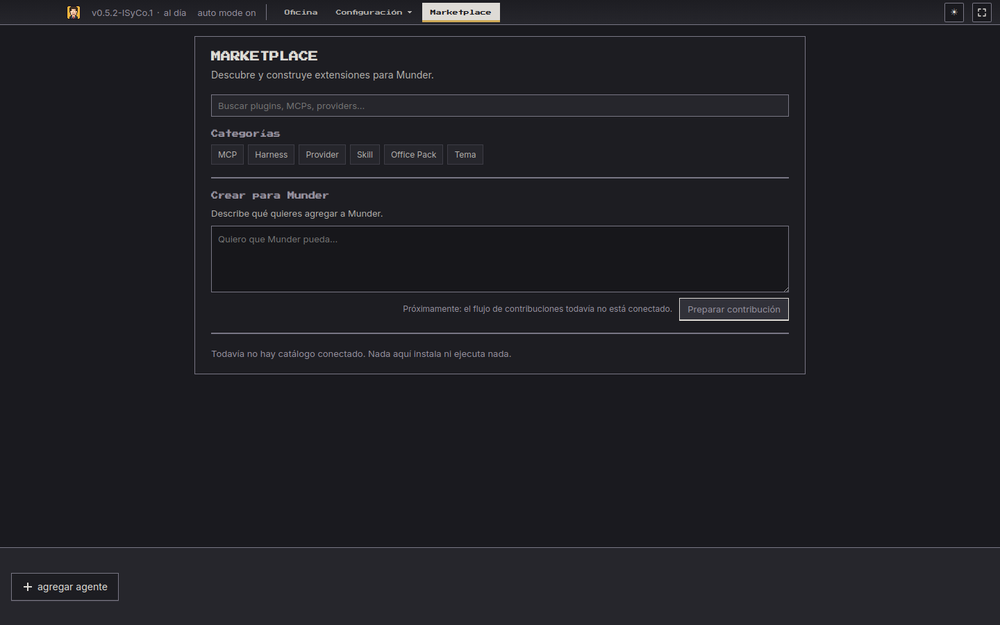
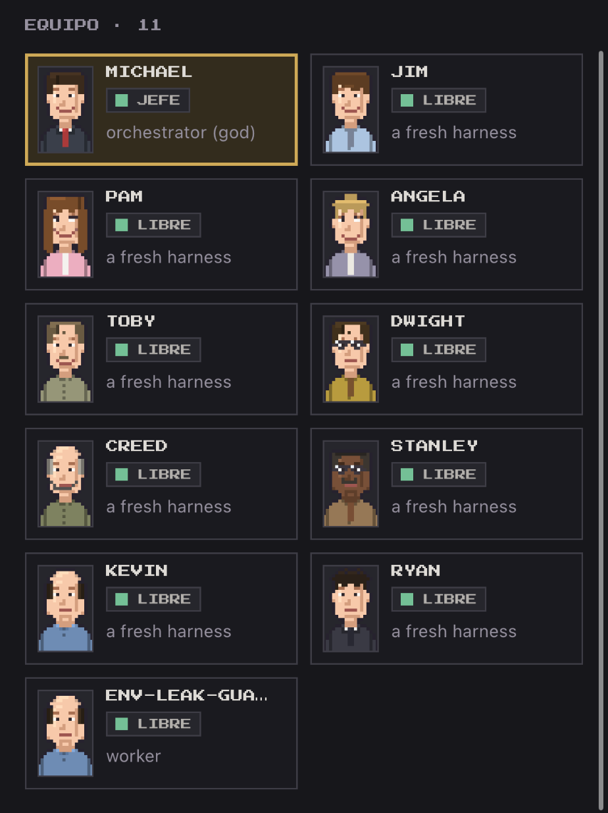
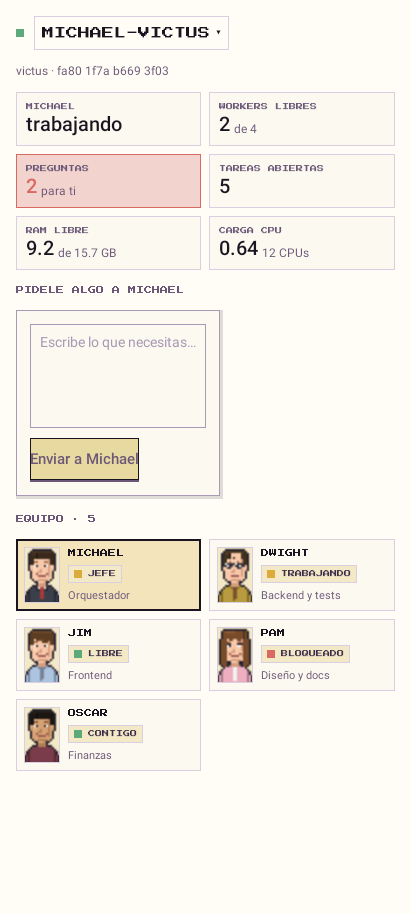
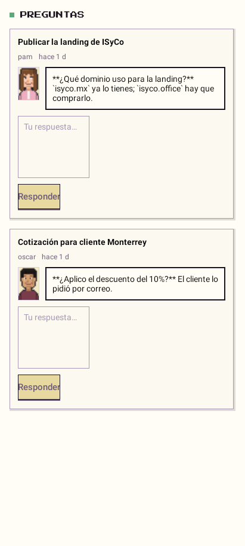
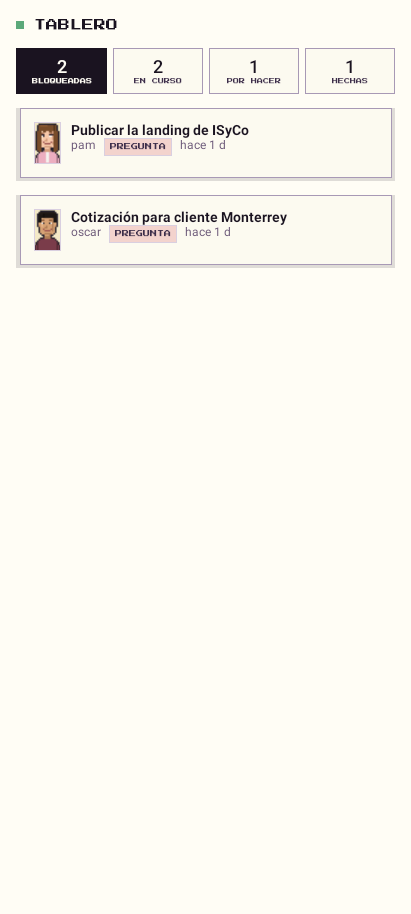
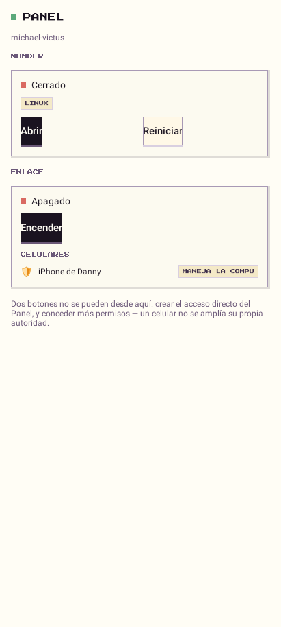

# Munder Difflin — Fork ISyCo

### Tu oficina de agentes de IA: en tu computadora, en la de al lado y en tu celular

  

## ¿Qué es esto?

Imagina una oficina donde cada empleado es una IA. **Tú hablas con Michael, el jefe**, y él reparte el trabajo: uno programa, otro investiga, otro revisa. Tú ves todo en una oficina en pixel art: quién está trabajando, quién está libre y en qué va cada quien.

   
  Una oficina de verdad trabajando: Michael y Dwight ocupados, el resto del equipo libre.

Este fork en español le suma cosas que no trae el original:

| | |
|---|---|
| 📱 **Tu oficina en el iPhone** | Contesta las preguntas de Michael, revisa el tablero y mándale trabajo desde el celular, en casa o fuera de ella. Protegido con **Face ID**. |
| 🤖 **Tu oficina en Android** | Lo mismo que el iPhone, como APK: el mismo protocolo, la misma cara pixel-art y hasta el **Panel** para manejar la compu. Protegido con **huella o PIN**. |
| 🔗 **Dos computadoras, una oficina** | Tu laptop le pasa trabajo a la PC grande. Cada una tiene su Michael y se ayudan. |
| 💬 **ChatGPT como un compañero más** | ChatGPT puede ver tu oficina y mandarle trabajo, con los permisos que tú le des. |
| 🛟 **Se levanta sola si se cae** | Si Munder se cierra por error, se vuelve a abrir sin que hagas nada. |
| 🧠 **No olvida al reiniciar** | Cierras y abres Munder, y cada agente sigue en su misma conversación y con su configuración. |
| 🇲🇽 **Todo en español** | Menús, avisos y ayudas. |

> Es un fork de [chaitanyagiri/munder-difflin](https://github.com/chaitanyagiri/munder-difflin), al día con su 0.5.2.

---

## 🚀 Empieza en 3 pasos

**1. Instala un «cerebro» para tus agentes.** Munder no trae IA propia: usa la que ya tienes. Lo más fácil es [Claude Code](https://claude.com/claude-code). También sirven Codex, Gemini, OpenCode, Copilot y otros.

**2. Descarga Munder.** Entra a [**Releases**](https://github.com/DannyBaanks/munder-difflin/releases) y baja el de tu sistema:

| Tu computadora | Descarga |
|---|---|
| 🪟 Windows | el instalador `.exe` (o la versión portable) |
| 🐧 Linux | el `.AppImage` |
| 🍎 Mac | el `.dmg` del [proyecto original](https://github.com/chaitanyagiri/munder-difflin/releases/latest) |

**3. Ábrelo.** La primera vez te pregunta el idioma y qué IA usar. Luego toca **agregar agente** y listo: Michael se sienta en su oficina y tu equipo en sus escritorios.

> 💡 Abre Munder **una sola vez**. Si lo abres dos veces, la segunda copia se cierra sola para no pelearse con la primera.

---

## 🗺️ Cómo se usa

Arriba tienes tres pestañas. Siempre sabes dónde estás:

  

| Pestaña | Para qué es |
|---|---|
| **Oficina** | El piso con tu equipo. Tocas a un agente para ver su terminal, y a la derecha está el **Centro de comando**: tareas, preguntas, historial, memoria y más. |
| **Configuración ▾** | Todos los ajustes, a un clic: agentes y modelos, conexiones, Munder Link, voz, memoria… |
| **Marketplace** | *Próximamente:* aquí vas a encontrar extensiones y pedir cosas nuevas para Munder. Por ahora solo es la vitrina. |

Cambiar de pestaña **no detiene a nadie**: tus agentes siguen trabajando aunque estés viendo otra cosa.

   
  El Marketplace en modo oscuro. Todavía no instala nada, y lo dice claro.

---

## 📱 Munder Mobile: tu oficina en el iPhone

Michael te hace una pregunta y no estás en la compu. Contéstale desde el celular y la oficina sigue trabajando.

  
  
  
  

Las tres primeras son del simulador (modo demo); la última es un iPhone 12 real conectado por Tailscale.

| Pestaña | Qué haces ahí |
|---|---|
| **Oficina** | Ves si Michael está ocupado, cuántos agentes están libres y le escribes a él o a cualquiera del equipo. Arriba puedes cambiarte a tus otras oficinas. |
| **Preguntas** | Contestas lo que te preguntaron. Michael lo recibe al instante. |
| **Tablero** | Tareas bloqueadas, en curso, por hacer y terminadas. |
| **Enlace** | Tus otras oficinas y a dónde se conecta el celular. |

### 🔒 Nadie más puede usarla

Si alguien toma tu celular, no puede ver tu oficina ni hacer cambios:

- La app **abre bloqueada** y pide **Face ID** (o el código del iPhone).
- Si la dejas en segundo plano más de un minuto, **se vuelve a bloquear**.
- Mandar algo, contestar, delegar o borrar **vuelve a pedir Face ID**.
- Munder **nunca ve tu cara ni tu código**: el iPhone solo le dice «sí es el dueño» o «no».

### Cómo instalarla

1. **Baja la app:** en [**Actions → iOS (Munder Mobile)**](https://github.com/DannyBaanks/munder-difflin/actions/workflows/ios.yml) abre la última corrida en verde de `main` y descarga **MunderMobile-unsigned-ipa**.
2. **Instálala en tu iPhone** con [**iloader**](https://iloader.app) y tu Apple ID gratuito (también sirven SideStore o AltStore).
3. **Confía en la app:** en el iPhone, **Ajustes → General → VPN y administración de dispositivos**, y activa el **Modo de desarrollador** si te lo pide.
4. **Prende el enlace en la computadora:** en Munder, **Configuración → Munder Link → Encender**. Ahí mismo, en **Celulares**, aparece la dirección para el iPhone.
5. **Empareja:** escribe esa dirección en la app, toca **Emparejar** y en la computadora acepta el código de 6 dígitos **solo si es el mismo** que ves en el celular.

> 🌎 **¿Fuera de casa?** Instala [Tailscale](https://tailscale.com) en la computadora y en el iPhone, y usa la dirección de Tailscale (la que empieza con `100.`). La app aprende las dos direcciones y usa la que conteste: la de tu red en casa y la de Tailscale en la calle.

> ⏳ Con un Apple ID gratuito la app **dura 7 días**. Luego la vuelves a firmar con iloader y sigue funcionando con tu mismo emparejamiento.

Guía completa: [`ios/MunderMobile/README.md`](./ios/MunderMobile/README.md). ¿Sin iPhone? También hay una versión web que se instala desde el navegador: [`tools/munder/LINK.md`](./tools/munder/LINK.md#munder-remote-la-oficina-desde-el-celular).

---

## 🤖 Munder Mobile: tu oficina en Android

La misma app del iPhone, como APK nativo (Kotlin + Compose). No es otra forma de conectarse: **el celular es solo un sustrato** y los dos pasan por los mismos procesos — mismos ops (`overview peers answer ask delegate panel.state panel.action`), misma autoridad, mismos bytes cifrados (`munder-remote@1`) y la misma cara pixel-art con el elenco.

  
  
  
  

Las cuatro son del CI en JVM con la oficina demo; más en modo oscuro y bloqueo en <code>docs/isyco/mobile/android/</code>.

Trae una pestaña más que el iPhone no tenía al principio: **Panel**. Desde ahí abres y cierras Munder, prendes y apagas el enlace, enciendes GPT y manejas el revividor — los mismos botones del Panel de escritorio, ejecutando lo mismo. Eso sí: emparejar no da ese poder; se concede en la computadora con `munder link panel <celular>`.

### 🔒 Nadie más puede usarla

Igual que en el iPhone, pero con lo de Android:

- La app **abre bloqueada** y pide tu **huella o el PIN**.
- Si la dejas en segundo plano más de un minuto, **se vuelve a bloquear**.
- Mandar algo, contestar, delegar, tocar el Panel o borrar **vuelve a pedir que seas tú**.
- La llave de sesión vive en el **Keystore cifrado** del aparato. Munder nunca ve tu huella ni tu PIN.

### Cómo instalarla

1. **Baja el APK:** en [**Actions → Android (Munder Mobile)**](https://github.com/DannyBaanks/munder-difflin/actions/workflows/android.yml) abre la última corrida en verde de `main` y descarga **MunderMobile-debug-apk**.
2. **Instálalo** en tu Android (permite instalar de fuentes desconocidas).
3. **Prende el enlace en la computadora:** en Munder, **Configuración → Munder Link → Encender**.
4. **Empareja:** escribe la dirección en la app, toca **Emparejar** y en la computadora acepta el código de 6 dígitos **solo si es el mismo** que ves en el celular.

> 🌎 **¿Fuera de casa?** Igual que el iPhone: instala [Tailscale](https://tailscale.com) en la computadora y en el Android, y usa la dirección de Tailscale (la que empieza con `100.`).
>
> ✅ En Android la app **no caduca**: no hay que firmarla cada 7 días como en el iPhone.

Guía completa: [`android/MunderMobile/README.md`](./android/MunderMobile/README.md).

---

## 🔗 Munder Link: dos computadoras, una oficina

¿Tienes una laptop y una PC con más RAM? Enlázalas y tu Michael le pasa trabajo al Michael de la otra, por tu red de casa o por Tailscale. Ninguna toca los archivos de la otra: la tarea le llega al otro Michael y él decide cómo hacerla.

**Cómo:** en las dos computadoras, **Configuración → Munder Link → Encender → Buscar**. Elige la otra, confirma que el código de 6 dígitos sea igual en las dos pantallas, y listo.

  

Todo lo que viaja entre oficinas va cifrado y firmado.

---

## 💬 ChatGPT en tu oficina

Conecta ChatGPT y pídele cosas como *«dile a Michael que revise las pruebas»* o *«¿qué está haciendo la oficina del Xeon?»*.

- **Tú decides cuánto puede hacer:** solo ver, ver y pedir, o todo.
- **Cada conexión la apruebas tú** con un código, y la quitas cuando quieras.
- **Todo queda anotado** a nombre de ChatGPT, para que sepas qué hizo.

Cómo conectarlo: [`tools/munder/GPT.md`](./tools/munder/GPT.md).

---

## 🛟 Munder Reviver: si se cae, se levanta

Un ayudante chiquito que vive junto a Munder:

- **Si Munder se cae,** lo vuelve a abrir. Lo intenta unas cuantas veces y, si no puede, te avisa en vez de insistir para siempre.
- **Si lo cerraste tú,** lo respeta y lo deja cerrado.
- **Desde el celular o ChatGPT** puedes preguntar «¿está vivo?» y levantarlo, aunque Munder esté totalmente caído.

Cómo activarlo: [`tools/munder/REVIVER.md`](./tools/munder/REVIVER.md).

---

## ✨ Más cosas que puedes hacer

- **🧰 Oficinas listas para tu negocio.** Arranca con un equipo ya armado para servicios del hogar, servicios profesionales, restaurante, tienda o consultoría.
- **📄 Tus agentes leen tus documentos.** Word, Excel, PowerPoint y PDF. Si un archivo no se puede leer, te lo dicen en vez de inventar.
- **🧑‍🎨 Ponte tú en la oficina.** Describe tu personaje («piel morena, blusa rosa, gafas») y entra al piso en pixel art como uno más del equipo.

   
  Personajes creados solo con una descripción.

---

## 🆘 Si algo no jala

| Pasa esto | Prueba esto |
|---|---|
| Munder se cierra solo al abrirlo | Ya hay otro Munder abierto. Búscalo en tu barra de tareas y usa ese. |
| El celular dice «No alcanzo la oficina» | En la computadora, **Configuración → Munder Link** debe estar **encendido**. Revisa que los dos estén en la misma red Wi-Fi, o los dos con Tailscale prendido. |
| El celular dice que la hora no coincide | Activa la **hora automática** en el celular y en la computadora. |
| El celular dice que ya no lo reconocen | Lo olvidaron en la computadora. En la app toca **Olvidar en este celular** y vuelve a emparejar. |
| La app del iPhone dejó de abrir | Pasaron los 7 días del Apple ID gratuito: fírmala otra vez con iloader. |
| No encuentra la otra computadora | Usa Tailscale en las dos, o pídele a quien sepa que abra los puertos 47831 y 47832 en el firewall. |
| Un agente empezó una conversación nueva | La primera vez después de actualizar es normal. A partir de ahí, cada reinicio retoma la misma conversación. |

---

<b>⌨️ Para quien usa la terminal: el comando <code>munder</code></b>

Todo lo de arriba también se hace desde la terminal. Instálalo una vez con `./tools/munder/install.sh`.

| Quiero… | Comando |
|---|---|
| Abrir, cerrar o reiniciar la app | `munder start` · `munder stop` · `munder restart` |
| Ver si está corriendo y sus logs | `munder status` · `munder logs -f` |
| Ver o armar el equipo | `munder sesion ver` · `munder sesion armar` |
| Oficina lista para tu giro | `munder sesion packs` · `munder sesion armar --pack retail-shop` |
| Enlazar otra computadora | `munder link conectar` |
| Dirección para el celular | `munder link encender` · `munder link celular` |
| Aceptar un celular | `munder link aceptar <código>` |
| Que Munder se levante solo | `munder reviver init` · `munder reviver instalar` |
| Conectar ChatGPT | `munder gpt perfil full` · `munder gpt encender` · `munder gpt aprobar <código>` |
| Mandar una tarea a un harness externo | `munder harness run <adaptador> "tarea" --cwd <carpeta>` |
| Crear un avatar | `munder avatar compilar "descripción"` |

Desde el código: `git clone`, `npm install` y `./start.sh` (Node 18+ y herramientas de C++). Detalle en [`tools/munder/README.md`](./tools/munder/README.md).

<b>Para desarrolladores: todo lo que cambia este fork, con detalle técnico</b>

### 1. Español primero
Selector de idioma en el onboarding (`en/es/zh-CN/ar`). El inglés sigue siendo el idioma por defecto: nada cambia hasta que eliges otro en Settings. `es.json` está completo, en Title Case y sin artefactos de traducción automática.

### 2. Canal de control local (`127.0.0.1`)
Canal solo de loopback, con un token `0600` guardado en userData. Rutas: `munder ctl ping`, `GET /salud`, `GET /sesion`, `POST/DELETE /sesion/agentes`, y repintado bajo demanda sin reiniciar. Sin token se rehúsa, y nada de este puerto sale de la máquina.

### 3. Launcher Linux `./start.sh`
Arregla el congelamiento «Detenido»:
- Electron se despega de la terminal con `setsid`, y su salida va a `~/.local/state/munder-difflin/run-*.log`.
- Sin terminal de control, el job control ya no le manda `SIGTSTP`.
- Si falla la GPU, reintenta con renderizado por software.
- Guardia singleton por userData; `--fg` es solo para depurar.

Ver `./start.sh --check`.

### 4. Supervisión de entrega (router + breaker)
- **Router caído:** si hay outbox encolado y el router murió, el beat de 8 s lo rearma y drena (peor caso ~9.5 s, log `router-supervise`).
- **Eventos sin `tool_input`** (Pi bridge, plugin OpenCode): ya no cuentan como loop idéntico. Las reglas de velocity, error-storm y no-progress siguen igual.

Ver [`docs/delivery-reliability-decision.md`](./docs/delivery-reliability-decision.md).

### 5. Canvas + terminal Linux
- `useCanvasRepaint` repinta los retratos 2D después de que muere el proceso de GPU (heartbeat de 30 s, más focus/visible).
- `terminal:openAtFolder` abre tu terminal (gnome-terminal > ptyxis > konsole > …) en vez del `open -a` de macOS.

### 6. Harness usable + avatar compilado
- **Harness:** botón «create new config» en HivePicker, homes anidados en fresh mode, `.gitignore` automático en cada home, y sesiones paralelas con `--user-data-dir`.
- **Avatares:** son procedurales y comparten motor entre la app y el CLI (`composeAvatar`, `AVATAR_VOCAB`). El mismo texto da el mismo PNG, sin drift.

### 7. Catálogo + Office Bridge MCP
- `modelCatalog.json` trae la familia `openisy`.
- `mcpCatalog.ts` trae `office-bridge` (stdio local, con `HIVE_ROOT` inyectado) y sus herramientas: `compose_submit/task_get/task_message/task_cancel/office_status`.

Guía sin rutas personales en [`src/mcp/office-bridge/GUIA.md`](./src/mcp/office-bridge/GUIA.md).

### 8. CLI `munder`
`tools/munder/munder` es Node puro, sin dependencias. Comandos: `start / stop / restart / status / logs -f`, `sesion ver / armar / quitar / proveedor / packs`, `ctl ping / repaint`, `avatar compilar / inspect / inyectar`, `link …`. Receta de avatares para modelos en [`tools/munder/AVATAR_AGENTES.md`](./tools/munder/AVATAR_AGENTES.md).

### 9. Placeholder de worker («cuerpo prestado»)
- **Cómo entra:** `firstFreeCharacter()` elige un slot libre (nunca `michael`, que es del GOD) e `injectAvatarAs()` le inyecta tu receta e invalida sus cachés.
- **Qué no cambia:** el comportamiento y el hitbox (la clase `Character` es genérica). Las líneas de diálogo son las del slot prestado.
- **Persistencia:** `munder avatar inyectar … --slot auto` guarda la receta en `avatar-overrides.json`, y la app la aplica al arrancar.

### 10. Munder Link
- **Delegación:** el peer nunca toca tu hive ni tus PTYs. Deja la tarea en el inbox de tu Michael, en formato Office Bridge.
- **Seguridad de cada llamada:** firmada con Ed25519 y cifrada con X25519 + AES-256-GCM, con anti-replay y `re` que liga cada respuesta a su petición.
- **Emparejamiento:** código SAS de 6 dígitos (sas@2, que incluye las llaves de cifrado). `/pair` tiene rate limit, y el descubrimiento UDP solo contesta a IPs privadas.
- **Respuestas:** las tareas externas se marcan `link.external`; `origin_ref` enruta las respuestas de vuelta.

Guía: [`tools/munder/LINK.md`](./tools/munder/LINK.md).

### 11. Fachada ChatGPT sobre Munder Link
- **Qué es:** un servidor MCP local (`src/mcp/munder-chatgpt-link/`) que verifica peer + ruta (loopback, misma LAN o Tailscale) antes de cada llamada. Expone 7 herramientas: `verify/peers/status/submit/get/message/cancel`.
- **`self` contra `peers`:** `munder_link_peers` devuelve `self` aparte de `peers`, y `munder_office_status("self")` lee esta máquina directo, sin red. Delegar a `self` responde `self_not_a_peer`.
- **Probado end-to-end** (2026-09-25): chatgpt.com → fachada → link por LAN → Michael remoto. `compose_submit` llegó `accepted` con recibo (`task-1790331110686-46d4bbdb`, same_lan vía wlo1, 22 ms).
- **Túnel:** cada quien levanta el suyo con [`chatgpt-tunnel.sh`](./src/mcp/munder-chatgpt-link/chatgpt-tunnel.sh). Tu URL es pública y de vida corta, y la de otra persona no te sirve a ti.

### 12. Munder Link desde Configuración
- **Mismo motor que el CLI:** `src/main/linkPanel.ts` es una capa delgada sobre `lib-link.cjs`, con la misma identidad, los mismos peers y el mismo archivo pid. Lo que prendes en la app lo apagas en la terminal, y al revés.
- **Sin llaves en la pantalla:** el renderer nunca maneja llaves; solo un token de un uso que emite el proceso principal.

  

### 13. Guardia del hive + piso de versión de Claude Code
- **Guardia del hive:** un hook `PreToolUse` niega los `Write/Edit/MultiEdit/NotebookEdit` fuera de lo que le toca a cada agente: su `memory.md`, su inbox/outbox y `tasks.json`; el GOD además `board.md` y `spawn-requests/`.
- **Piso de versión:** si pides un modelo más nuevo que tu Claude Code (Opus 5.5 pide 2.1.280+), arranca con el más nuevo que tu CLI soporta.

### 14. Office Packs
Plantillas `core` más cinco giros. Las de packs importados limitan a «pedir permiso» todo lo que envía, publica, paga o borra.

### 15. Documentos para los agentes
- La base de conocimiento convierte Word/Excel/PowerPoint/PDF fuera del proceso main, en vez de indexar bytes como texto.
- Si no puede leer un archivo, lo dice en lugar de guardar basura.
- Los agentes tienen `doc-text` para leerlos.

### 16. CI en Linux, Windows y macOS
Cada push compila y corre la suite en los tres sistemas. Encontró un bug real: en Windows, borrar un worktree podía seguir el junction de `node_modules` hasta el checkout principal. Hoy un test con un `must-survive.txt` lo vigila.

### 17. Munder Mobile: PWA + iOS nativo + Android nativo
- **PWA:** el daemon de Link sirve la app web en `/app` y su API sellada en `/remote/v1/*`, en `tools/munder/lib-remote.cjs`.
- **Emparejamiento commit-reveal:** el nonce del celular va comprometido antes de ver el de la oficina, así nadie en medio puede probar nonces hasta que coincidan los códigos.
- **Llamadas:** ChaCha20-Poly1305 bajo X25519 + HKDF, con hora y anti-replay.
- **Criptografía de la PWA:** va en JS puro (`remote-app/remote-crypto.js`) porque el navegador no da WebCrypto por `http://`. Los tests la comparan byte a byte con Node.
- **App iOS nativa:** `ios/MunderMobile/` implementa el mismo protocolo `munder-remote@1` en SwiftUI, guarda las llaves en el Keychain y prueba las direcciones LAN/Tailscale de la oficina.
- **App Android nativa:** `android/MunderMobile/` es el gemelo del iPhone en Kotlin + Compose — mismos ops, misma autoridad `OP_AUTHORITY`, mismos bytes (BouncyCastle en vez de CryptoKit), Keystore en vez de Keychain y BiometricPrompt en vez de Face ID. La red va en `Dispatchers.IO` y el `applicationId` es el mismo bundle (`mx.isyco.munder.mobile`).
- **Generado y verificado:** `scripts/make-assets.cjs` produce retratos, icono, vectores y fixtures; el CI falla si quedan viejos y los tests del simulador comparan los bytes con la oficina. `android/.../scripts/check-assets.cjs` exige que el APK lleve copias byte por byte y la misma lista `PANEL_OFF`.
- **Capturas reales:** el job `Simulator screenshots (demo office)` publica las pantallas del iPhone en el artifact y las copias de referencia quedan en `docs/isyco/mobile/ios/`. El job `Screenshots (Roborazzi, demo office)` hace lo mismo con Android en JVM — sin emulador, porque los runners hospedados no tienen KVM ni HVF — y las copias quedan en `docs/isyco/mobile/android/`.
- **Dónde viven los celulares:** en `remotes.json`, nunca en `peers.json`.
- **Operaciones:** `overview`, `peers`, `answer` (igual que ASK ME), `ask` y `delegate`, más el estrato Panel (`panel.state`, `panel.action`).

### 18. Munder Reviver (plano de mantenimiento)
- **Independiente:** `tools/munder/lib-reviver.cjs` usa solo builtins de Node y tiene su propia llave y sus propios clientes. No necesita a Munder, Link, el hive ni Electron.
- **Sano = cuatro pruebas:** el proceso del destino configurado, `/salud` con el token de ese arranque, el mismo pid y el `office_id` fijado. Para eso `/salud` ahora dice `pid`, `version` y `office_id`.
- **Sin shell:** solo `status`, `start`, `restart` y `stop`. El destino vive en `config.json`.
- **Protocolo:** Ed25519 en los dos sentidos, con nonce de un solo uso, ±60 s de hora y la petición atada al reviver y a la oficina.
- **Para solo lo que es suyo:**
  - fuerza únicamente al proceso principal y a sus helpers `--type=`;
  - nunca toca el daemon de Link, la terminal de un humano ni un `opencode` ajeno;
  - ante la duda, falla cerrado.
- **Watchdog acotado:** 3 intentos en 10 min, con espera entre ellos, y luego un estado `failed`. Distingue un cierre limpio de una caída.
- **Instalación:** systemd `--user` con `KillMode=process`; en Windows, tarea al iniciar sesión con `RestartOnFailure`.
- **ChatGPT:** un conector MCP aparte (`reviver-mcp.cjs`, `chatgpt-tunnel.sh --reviver`) con el mismo filtro de red que `munder-chatgpt-link`.

### 19. Munder GPT (principal `gpt`)
- **Autoridad:** ChatGPT es un principal de Munder con perfil `lectura`, `operador` o `full`. Cada permiso tiene el perfil actual como tope, caduca y se puede revocar.
- **OAuth 2.1 con builtins de Node:**
  - registro dinámico;
  - PKCE S256;
  - aprobación del operador en la terminal con un código de 6 dígitos;
  - tokens guardados solo como hash;
  - refresh que rota.
- **Probado contra el cliente OAuth oficial del SDK de MCP.**
- **Buzón:** `"to": "gpt"` se entrega en `<hive>/gpt/inbox` solo si `munder gpt` lo creó; si no, rebota como antes.
- **Inventario:** clasifica cada operación de Remote, Link, el canal de control y el Reviver. Un test lee esas fuentes y falla si aparece una sin clasificar.
- **Link intacto:** por Link, GPT es un peer y solo ve lo que esta oficina delegó.

### 20. Barra global: Oficina · Configuración ▾ · Marketplace
- **Una sola Configuración:** `components/globalNavModel.ts` tiene la lista de secciones que pintan el menú y `SettingsModal`; el menú abre el mismo modal en esa sección.
- **Marketplace como capa:** se pinta encima del piso sin desmontarlo; terminales y agentes siguen vivos. Sin catálogo todavía (`MARKETPLACE_CATALOG_CONNECTED = false`).
- **Accesible:** botón de menú ARIA con teclado completo; densidad por ancho (≥1180 / 900–1179 / <900 px). Auditoría y capturas en [`docs/ui-shell/`](./docs/ui-shell/README.md).

### 21. OpenCode/OpenISy retoman su conversación
- El plugin puente reporta el `session_id` **raíz** (nunca el de un subagente) y `hive.recordSession` lo guarda.
- Los presets usan `--session <id>`, pero solo si la sesión sigue en `opencode.db` o en el storage JSON; si no, arranca limpio en vez de morir con «Session not found».
- `opencode.json`/`tui.json` del agente se **fusionan** (`mergeJsonFile`), ya no se reescriben con solo el tema.

### 22. Munder Mobile por Tailscale + Face ID
- **ATS:** solo `NSAllowsArbitraryLoads`. Con `NSAllowsLocalNetworking` presente, iOS 10+ ignora la primera y bloqueaba las IP de Tailscale (100.64.0.0/10). `test/ios-ats.test.cjs` lo vigila; el contenido ya va cifrado por `RemoteCrypto`.
- **Bloqueo:** `AppLock` y `LockPolicy` en `MunderMobileCore`, con `.deviceOwnerAuthentication` (Face ID con el código de respaldo). Bloquea al abrir y tras 60 s en segundo plano; reautentica cada acción que cambia la oficina fuera de una ventana de 30 s; tapa la captura del selector de apps. Un iPhone sin código abre con aviso.

### 23. El Panel en el celular: dos autoridades sobre un solo canal
- El celular ya es un cliente del estrato del Panel, no un clon: `panel.state` y `panel.action` viajan por el mismo sello `munder-remote@1` y ejecutan los mismos motores (`lib-panel.cjs` `ACTIONS`) que los botones de escritorio. Un solo protocolo, y la app nativa no reimplementa la oficina: la pide.
- **El código de emparejamiento no abre la computadora.** Da la *oficina* (tablero, preguntas, la gente). Los ops que tocan el host llevan clase de autoridad `machine` y se niegan con `no_authority` hasta que alguien en la máquina lo concede: `munder link panel <celular>` (o el botón `link.phoneAuthority` del Panel, que es de escritorio y **no** está en el set del celular — un teléfono no puede ampliarse su propia autoridad). `--quitar` la devuelve.
- **Por clase de autoridad y no por lista:** `app.restart` apaga tu Munder y `gpt.approve` autoriza un agente. Compartir credencial con `answer` habría convertido el teléfono en control remoto de la máquina con la misma llave que usa para leer el tablero. `OP_AUTHORITY` es fail-closed: un op sin declarar se trata como `machine`.
- **Techo medido, no supuesto:** `panel.state` pesa 0,5% del límite de 256 KiB en una oficina viva y 17,8% en el peor caso construido con formas reales (100 peers, 50 celulares, 200 grants). Ningún op necesita paginación todavía. `ARG_MAX` declara el tope de cada argumento en el camino del celular, porque el Panel de escritorio no tenía ninguno.
- `shortcut.install` y `link.phoneAuthority` quedan fuera del celular (`PANEL_OFF`): escriben en una pantalla que el teléfono no ve, y el segundo sería circular.

### 24. Harnesses externos (P0)
- `munder harness` entrega una tarea a `codex exec` (JSONL) o a cualquier agente ACP v1, como DeepSeek Harness (`dsh --profile acp`), con selección explícita y sin ruteo.
- Munder decide el veredicto, mide los artefactos con git, escribe el recibo, borra secretos por nombre, forma y valor, y corta la recursión con `MUNDER_HARNESS_CHAIN`.
- Contrato en [`tools/munder/HARNESS_CONTRACT.md`](./HARNESS_CONTRACT.md); auditoría en [`tools/munder/EXTERNAL_HARNESS_AUDIT.md`](./EXTERNAL_HARNESS_AUDIT.md).

## Garantías de este fork

* **Nada va al upstream.** El remoto es `fork=DannyBaanks/munder-difflin`.
* **Sin llaves en el repo.** Solo hay placeholders (`xoxb-...`) en docs y comentarios.
* **`avatar-engine.cjs` no se edita a mano.** Se genera desde `portraitArt.ts` con `node tools/munder/sync-avatar-engine.cjs`, y la suite verifica su hash.
* **Tests:**
  * `npm run test:focused` (los mismos en los tres sistemas)
  * `node --test tools/munder/link.test.cjs tools/munder/remote.test.cjs tools/munder/avatar.test.cjs tools/munder/reviver.test.cjs tools/munder/gpt.test.cjs tools/munder/harness.test.cjs`
  * `npm run typecheck`
* **Gate de release:** `node tools/check-release-links.cjs --live` comprueba que cada descarga anunciada exista de verdad.

## Licencia

El código es **MIT**; ver [`LICENSE`](./LICENSE).

El pixel-art de la oficina, incluido el banner de arriba, usa *Modern Interiors - RPG Tileset [16X16]* de [LimeZu](https://limezu.itch.io/moderninteriors). Tiene licencia Complete Version con crédito obligatorio y no está cubierto por el MIT; ver [`LICENSE-ASSETS`](./LICENSE-ASSETS). Los personajes son procedurales y propios del proyecto.

Parodia afectuosa, sin afiliación con NBC, *The Office* ni Dunder Mifflin.
