<div align="center">


# Munder Difflin — Fork ISyCo

### Tu oficina de agentes de IA: en tu computadora, en la de al lado y en tu celular

[](https://github.com/DannyBaanks/munder-difflin/actions/workflows/ci.yml)
[](https://github.com/DannyBaanks/munder-difflin/releases)
[](https://github.com/DannyBaanks/munder-difflin/actions/workflows/ci.yml)
[](./LICENSE)

</div>

<p align="center">
  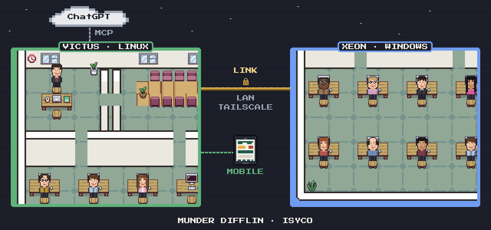
</p>

## ¿Qué es esto?

Munder Difflin es una **oficina de agentes de IA** que corre en tu computadora. Tú le pides algo a **Michael** (el jefe) y él reparte el trabajo entre su equipo. Cada agente es un Claude Code, Codex, Gemini u otro CLI trabajando en su propia terminal. Todo se ve como una oficina en pixel art: quién está trabajando, quién está libre y qué tarea lleva cada quien.

Este fork en español ([DannyBaanks/munder-difflin](https://github.com/DannyBaanks/munder-difflin)) le agrega tres cosas grandes:

- 🔗 **Dos computadoras, una oficina.** Tu Michael le puede pasar trabajo al Michael de otra máquina (Munder Link).
- 📱 **Tu oficina en el celular.** Contesta las preguntas de Michael, revisa el tablero y delega desde la PWA o la app nativa de iPhone (Munder Mobile).
- 🇲🇽 **Todo en español**, con una terminal cómoda (`munder`) para no depender de `npm run dev`.

> Es un fork de [chaitanyagiri/munder-difflin](https://github.com/chaitanyagiri/munder-difflin), al día con su 0.5.2. Este README cubre lo que cambia en el fork y lo mínimo para correrlo. El producto base se documenta en [su README](https://github.com/chaitanyagiri/munder-difflin/blob/main/README.md), [`HIVE.md`](./HIVE.md), [`SPEC.md`](./SPEC.md) y [`DESIGN.md`](./DESIGN.md).

## Empieza aquí

### Opción A: descarga y listo

En [**Releases**](https://github.com/DannyBaanks/munder-difflin/releases) están el instalador y la versión portable para **Windows** (`.exe`) y la de **Linux** (`.AppImage`), con `SHA256SUMS.txt` para verificarlas. En **Mac**, el `.dmg` sale del [upstream](https://github.com/chaitanyagiri/munder-difflin/releases/latest). Para iPhone, la app nativa se compila como artifact de [**Actions → iOS (Munder Mobile)**](https://github.com/DannyBaanks/munder-difflin/actions/workflows/ios.yml); la guía está en [`ios/MunderMobile/README.md`](./ios/MunderMobile/README.md).

Solo necesitas **al menos un agente instalado**, por ejemplo [Claude Code](https://claude.com/claude-code) (`claude`). También sirven `codex`, `gemini`, `grok`, `kimi`, `qwen`, `opencode`, `crush`, `pi`, `copilot`, `cursor-agent` y `agy`.

### Opción B: desde el código

Necesitas Node.js 18 o más nuevo, las herramientas de C++ de tu sistema (para `node-pty`) y un agente como en la opción A.

```bash
git clone https://github.com/DannyBaanks/munder-difflin.git
cd munder-difflin
npm install          # también recompila node-pty para Electron
./start.sh           # abre la app ya compilada, sin amarrarla a tu terminal
```

La primera vez sale una bienvenida donde eliges idioma y motor. Luego, con **Add agent**, creas a tu primer agente: Michael se sienta en su oficina y los demás en sus escritorios.

> **Ojo:** abre una sola copia a la vez. `./start.sh` y `munder start` comparten configuración (`~/.config/munder-difflin`), y la segunda copia se cierra sola. Si de verdad quieres dos sesiones, usa `./start.sh --user-data-dir ~/.config/munder-difflin-harness2`.

## Lo que puedes hacer

Hay dos maneras de llevar la oficina al celular: la **PWA**, que se instala desde Safari en segundos, y la **app nativa de iPhone**, que ahora compila el CI en SwiftUI. Las dos hablan el mismo protocolo y se emparejan con el mismo código de seis dígitos.

### 📱 Munder Mobile: tu oficina en el celular

Michael te hace una pregunta y no estás en la compu. Contéstale desde el celular y la oficina sigue trabajando.

#### PWA: rápida y sin compilar

<p align="center">
  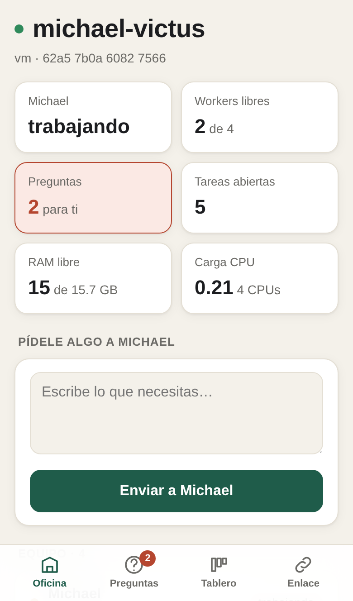
  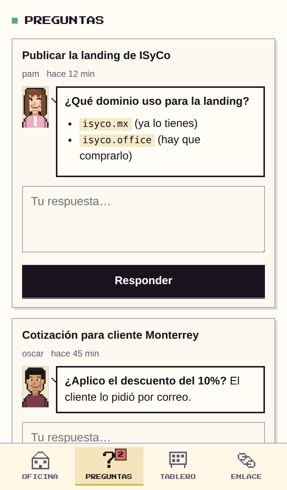
  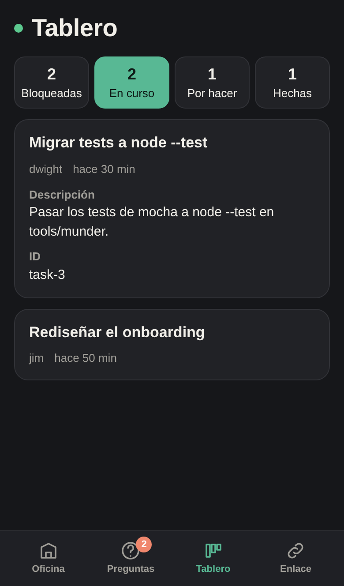
  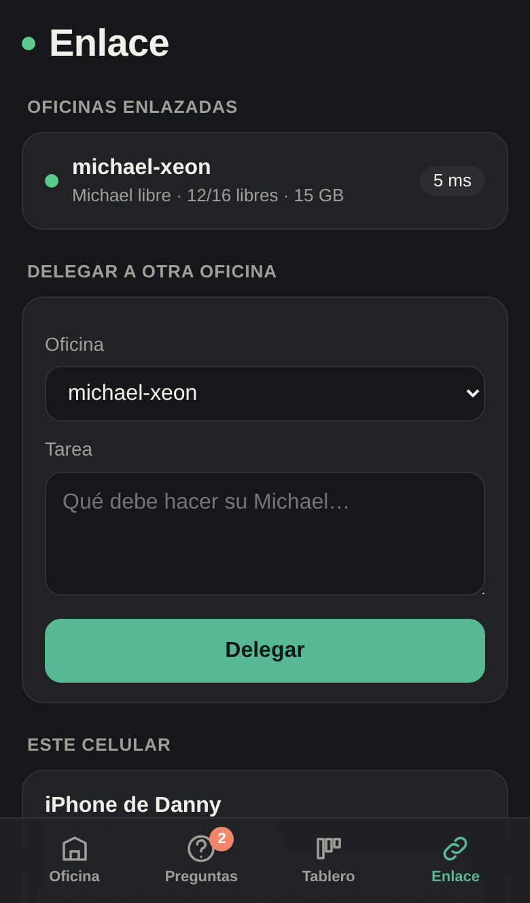
</p>

| Pestaña | Qué haces ahí |
|---|---|
| **Oficina** | Ves si Michael está trabajando, cuántos workers están libres, la RAM y el CPU, y le escribes lo que necesites. |
| **Preguntas** | Contestas lo que Michael o su equipo te preguntaron. La respuesta queda en la tarjeta y Michael la recibe al instante. |
| **Tablero** | Revisas las tareas bloqueadas, en curso, por hacer y las últimas terminadas. |
| **Enlace** | Ves tus otras oficinas en vivo y les pasas trabajo. |

**Cómo instalarla (una sola vez):**

En la computadora, prende el enlace y pide la dirección para el celular (también sale en la app, en **Configuración → Munder Link → Celulares**):

```bash
munder link encender
munder link celular
```

Luego:

1. En el iPhone, abre esa dirección en **Safari** y toca **Compartir → Agregar a inicio**.
2. Abre **Munder** desde el ícono nuevo y toca **Emparejar**.
3. El celular muestra un código de 6 dígitos. En la computadora sale el mismo código en **Solicitudes**: si coincide, toca **Aceptar** (o corre `munder link aceptar`). ¡Listo!

<p align="center">
  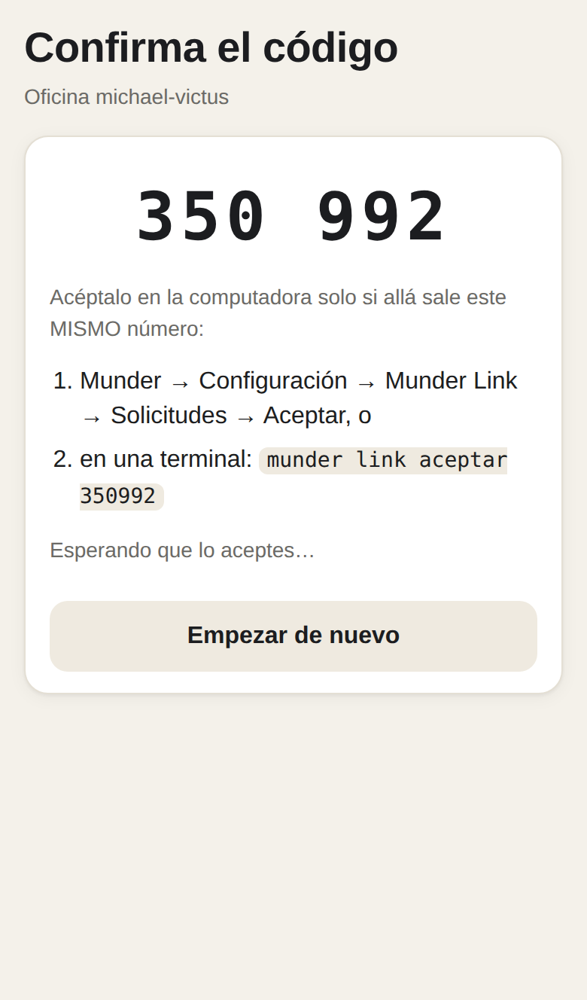
  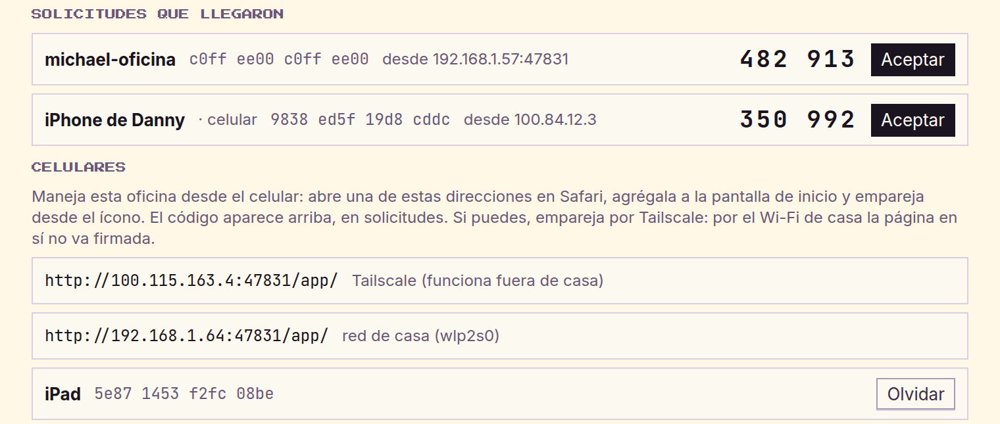
</p>

**Tips:**
- **Usa la dirección de Tailscale si puedes.** Funciona fuera de casa y todo el camino va protegido. Por el Wi-Fi de casa las llamadas van cifradas, pero la página en sí no va firmada.
- **Empareja desde el ícono, no desde Safari.** El ícono guarda sus datos aparte.
- **¿Perdiste el celular?** Olvídalo desde la computadora (**Olvidar** en Celulares, o `munder link olvidar <nombre>`) y deja de funcionar en ese momento.
- **Un celular no es una oficina.** Puede ver, contestar y pedir, pero nunca recibe trabajo.

La guía completa de la PWA está en [`tools/munder/LINK.md`](./tools/munder/LINK.md#munder-remote-la-oficina-desde-el-celular). En el código se llama **Munder Remote**.

#### iPhone nativo (SwiftUI)

La nueva app nativa hace lo mismo que la PWA, pero sin depender del navegador: las llaves viven en el **Keychain de iOS**, la app aprende las direcciones LAN/Tailscale de la oficina y prueba primero la que respondió la última vez. Las pantallas son SwiftUI y el CI corre los tests en el simulador.

<p align="center">
  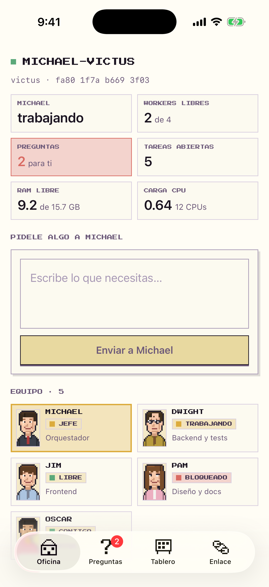
  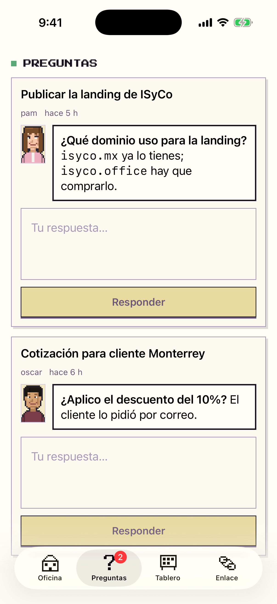
  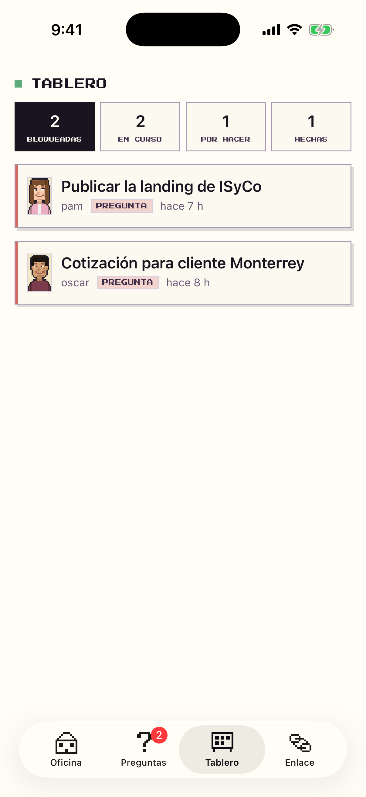
  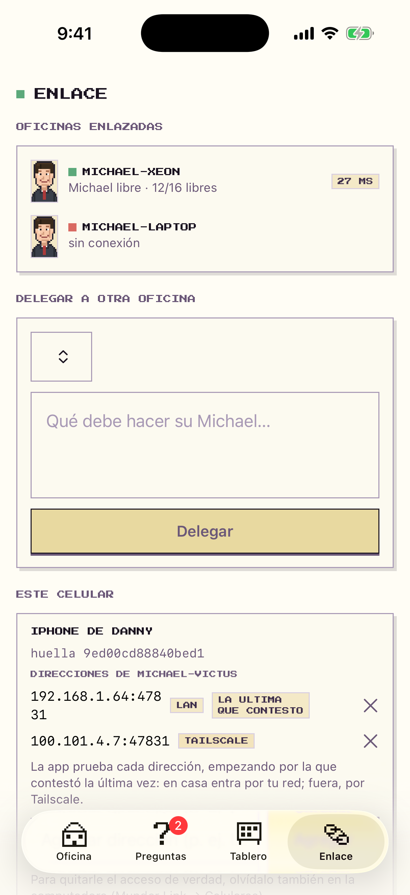
  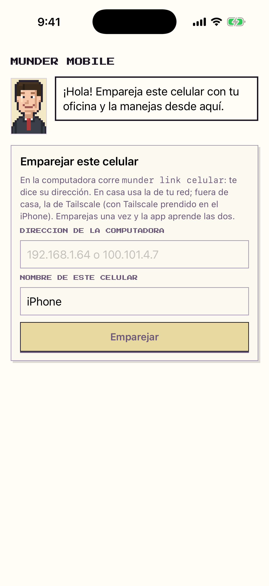
</p>
<sub>Capturas reales del simulador iPhone, generadas por el CI en modo demo (<code>-MunderDemo</code>); no son mockups.</sub>

**Cómo instalarla:**

1. En GitHub, abre [**Actions → iOS (Munder Mobile)**](https://github.com/DannyBaanks/munder-difflin/actions/workflows/ios.yml) y descarga el artifact `MunderMobile-unsigned-ipa` de la última corrida verde de `main`.
2. Firma el `.ipa` con tu Apple ID gratuito usando **iloader**, **SideStore** o **AltStore**.
3. En el iPhone, confía en tu Apple ID en **Ajustes → General → VPN y administración de dispositivos** y activa **Modo de desarrollador** si iOS lo pide.
4. En la computadora, prende el enlace:

```bash
munder link encender
munder link celular
```

5. Escribe esa dirección en la app, toca **Emparejar** y acepta el mismo código de seis dígitos en la computadora.

La guía completa —incluidos los límites de la cuenta gratuita de Apple, la renovación de firma y qué hacer si no contesta— está en [`ios/MunderMobile/README.md`](./ios/MunderMobile/README.md). Con una Apple ID gratuita la firma dura **7 días** y puedes tener hasta **3 apps** firmadas a la vez.

### 🔗 Munder Link: dos computadoras, una oficina

¿Tienes una laptop y una PC con más RAM? Enlázalas y tu Michael le pasa trabajo al Michael de la otra, por tu red de casa o por Tailscale. Ninguna toca los archivos de la otra: la tarea llega al buzón del otro Michael y él decide cómo hacerla.

```bash
munder link conectar     # en las dos máquinas: busca, empareja y listo
```

O sin terminal, desde **Configuración → Munder Link**: prender y apagar el enlace, buscar oficinas, emparejar con el código de 6 dígitos y ver cada oficina en vivo.

<p align="center">
  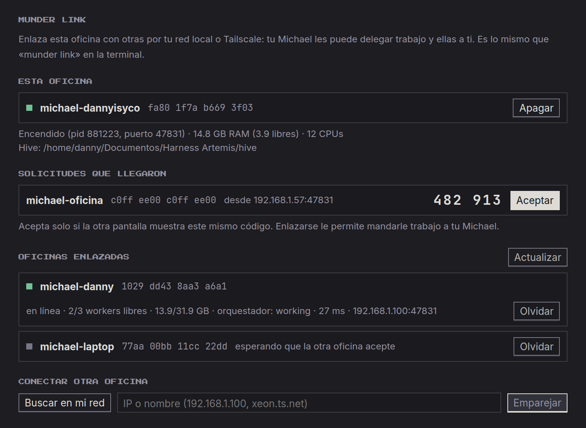
</p>

Cada mensaje entre oficinas va firmado y cifrado, y el emparejamiento se confirma viendo el mismo código en las dos pantallas. Guía con ejemplos reales: [`tools/munder/LINK.md`](./tools/munder/LINK.md).

### 💬 ChatGPT también puede mandar trabajo

Conecta ChatGPT a tu oficina y pídele cosas como «que la oficina del Xeon corra las pruebas». ChatGPT habla con un servidor local y ese servidor usa Munder Link, así que tu red no queda expuesta. ChatGPT sabe cuál es la oficina donde está conectado (`self`) y cuáles son las enlazadas. Cómo levantarlo: [`src/mcp/munder-chatgpt-link/README.md`](./src/mcp/munder-chatgpt-link/README.md).

### 🛟 Munder Reviver: si Munder se cae, se vuelve a levantar

Un proceso chiquito y aparte que vive junto a Munder y sabe hacer solo cuatro cosas: `status`, `start`, `restart` y `stop`.

- **Si Munder se cae,** lo levanta solo. Lo intenta un número limitado de veces y deja un recibo de cada intento.
- **Si lo cerraste tú,** lo deja cerrado.
- **Desde el celular o ChatGPT** («¿está vivo Munder en el Xeon? levántalo») funciona aunque Munder y Link estén muertos.
- **Solo cuenta como sano** si contesta con la identidad de tu oficina.
- **No toca lo que no es suyo:** nunca mata un `opencode` ni nada que no pueda comprobar que es el suyo.

```bash
munder reviver init && munder reviver instalar   # systemd --user en Linux, tarea al iniciar sesión en Windows
munder reviver status
```

Guía: [`tools/munder/REVIVER.md`](./tools/munder/REVIVER.md).

### 🧰 Oficinas listas para tu giro

Arranca con un equipo armado: servicios del hogar, servicios profesionales, restaurante, tienda o SaaS/consultoría.

```bash
munder sesion packs                                             # ver cuáles hay
munder sesion armar --pack retail-shop --cwd ~/tienda --solo oscar,pam
```

### 📄 Tus agentes leen Word, Excel, PowerPoint y PDF

Pásales tus documentos y los entienden. Si un archivo no se puede leer, te lo dicen en vez de inventar.

### 🧑‍🎨 Ponte tú en la oficina

Crea tu propio personaje en pixel art con una descripción, y entra al piso como un worker más:

```bash
munder avatar compilar "piel morena, blusa rosa, gafas"
munder avatar inyectar "piel morena, blusa rosa, gafas" --slot auto
```

<p align="center">
  <br>
  <sub>Salida real de <code>munder avatar compilar</code>: «piel morena, blusa rosa, gafas» ·
  «piel clara, pelo rojo, sudadera verde» · «piel oscura, pelo negro rizado, camisa azul» ·
  «piel clara, pelo largo castaño, blusa morada».</sub>
</p>

## La terminal `munder` (opcional, pero cómoda)

Una herramienta sin dependencias para manejar todo desde la terminal. Instálala una vez:

```bash
./tools/munder/install.sh        # crea ~/.local/bin/munder
```

| Quiero… | Comando |
|---|---|
| Abrir, cerrar o reiniciar la app | `munder start` · `munder stop` · `munder restart` |
| Ver si está corriendo y sus logs | `munder status` · `munder logs -f` |
| Ver o armar el equipo | `munder sesion ver` · `munder sesion armar` |
| Elegir CLIs y modelos | `munder sesion proveedor` |
| Enlazar otra computadora | `munder link conectar` |
| Que Munder se levante solo si se cae | `munder reviver init` · `munder reviver instalar` |
| Usar la oficina en el celular | `munder link celular` |
| Crear un avatar | `munder avatar compilar "descripción"` |

Detalle en [`tools/munder/README.md`](./tools/munder/README.md).

## Si algo no jala

| Pasa esto | Prueba esto |
|---|---|
| La app se cierra sola al abrirla | Ya hay otra copia abierta: `munder status`, y ciérrala con `munder stop`. |
| En Linux la app se queda «Detenida» | Ábrela con `./start.sh`, no desde `npm run dev` en primer plano. |
| El celular dice «sin conexión» | En la computadora: `munder link encender`. Revisa que estén en la misma red o los dos en Tailscale. |
| El celular dice que la hora no coincide | Activa la hora automática en el celular y en la computadora. |
| `munder link buscar` no encuentra la otra máquina | Abre en su firewall los puertos 47831/tcp y 47832/udp, o usa Tailscale. |
| El celular dice que ya no lo reconocen | Lo olvidaron en la computadora: toca «Olvidar en este celular» y vuelve a emparejar. |
| Munder se cerró y no estás en la compu | Si instalaste el Reviver: `munder reviver llamar <credencial> start` desde otra máquina, o `munder_start` desde ChatGPT. |

<details>
<summary><b>Para desarrolladores: todo lo que cambia este fork, con detalle técnico</b></summary>

### 1. Español primero
Selector de idioma en el onboarding (`en/es/zh-CN/ar`). El inglés sigue siendo el idioma por defecto: nada cambia hasta que eliges otro en Settings. `es.json` está completo, en Title Case y sin artefactos de traducción automática.

### 2. Canal de control local (`127.0.0.1`)
Canal solo de loopback, con un token `0600` guardado en userData. Rutas: `munder ctl ping`, `GET /salud`, `GET /sesion`, `POST/DELETE /sesion/agentes`, y repintado bajo demanda sin reiniciar. Sin token se rehúsa, y nada de este puerto sale de la máquina.

### 3. Launcher Linux `./start.sh`
Arregla el congelamiento «Detenido»:
- Electron se despega de la terminal con `setsid`, y su salida va a `~/.local/state/munder-difflin/run-*.log`.
- Sin terminal de control, el job control ya no le manda `SIGTSTP`.
- Si falla la GPU, reintenta con renderizado por software.
- Guardia singleton por userData; `--fg` es solo para depurar.

Ver `./start.sh --check`.

### 4. Supervisión de entrega (router + breaker)
- **Router caído:** si hay outbox encolado y el router murió, el beat de 8 s lo rearma y drena (peor caso ~9.5 s, log `router-supervise`).
- **Eventos sin `tool_input`** (Pi bridge, plugin OpenCode): ya no cuentan como loop idéntico. Las reglas de velocity, error-storm y no-progress siguen igual.

Ver [`docs/delivery-reliability-decision.md`](./docs/delivery-reliability-decision.md).

### 5. Canvas + terminal Linux
- `useCanvasRepaint` repinta los retratos 2D después de que muere el proceso de GPU (heartbeat de 30 s, más focus/visible).
- `terminal:openAtFolder` abre tu terminal (gnome-terminal > ptyxis > konsole > …) en vez del `open -a` de macOS.

### 6. Harness usable + avatar compilado
- **Harness:** botón «create new config» en HivePicker, homes anidados en fresh mode, `.gitignore` automático en cada home, y sesiones paralelas con `--user-data-dir`.
- **Avatares:** son procedurales y comparten motor entre la app y el CLI (`composeAvatar`, `AVATAR_VOCAB`). El mismo texto da el mismo PNG, sin drift.

### 7. Catálogo + Office Bridge MCP
- `modelCatalog.json` trae la familia `openisy`.
- `mcpCatalog.ts` trae `office-bridge` (stdio local, con `HIVE_ROOT` inyectado) y sus herramientas: `compose_submit/task_get/task_message/task_cancel/office_status`.

Guía sin rutas personales en [`src/mcp/office-bridge/GUIA.md`](./src/mcp/office-bridge/GUIA.md).

### 8. CLI `munder`
`tools/munder/munder` es Node puro, sin dependencias. Comandos: `start / stop / restart / status / logs -f`, `sesion ver / armar / quitar / proveedor / packs`, `ctl ping / repaint`, `avatar compilar / inspect / inyectar`, `link …`. Receta de avatares para modelos en [`tools/munder/AVATAR_AGENTES.md`](./tools/munder/AVATAR_AGENTES.md).

### 9. Placeholder de worker («cuerpo prestado»)
- **Cómo entra:** `firstFreeCharacter()` elige un slot libre (nunca `michael`, que es del GOD) e `injectAvatarAs()` le inyecta tu receta e invalida sus cachés.
- **Qué no cambia:** el comportamiento y el hitbox (la clase `Character` es genérica). Las líneas de diálogo son las del slot prestado.
- **Persistencia:** `munder avatar inyectar … --slot auto` guarda la receta en `avatar-overrides.json`, y la app la aplica al arrancar.

### 10. Munder Link
- **Delegación:** el peer nunca toca tu hive ni tus PTYs. Deja la tarea en el inbox de tu Michael, en formato Office Bridge.
- **Seguridad de cada llamada:** firmada con Ed25519 y cifrada con X25519 + AES-256-GCM, con anti-replay y `re` que liga cada respuesta a su petición.
- **Emparejamiento:** código SAS de 6 dígitos (sas@2, que incluye las llaves de cifrado). `/pair` tiene rate limit, y el descubrimiento UDP solo contesta a IPs privadas.
- **Respuestas:** las tareas externas se marcan `link.external`; `origin_ref` enruta las respuestas de vuelta.

Guía: [`tools/munder/LINK.md`](./tools/munder/LINK.md).

### 11. Fachada ChatGPT sobre Munder Link
- **Qué es:** un servidor MCP local (`src/mcp/munder-chatgpt-link/`) que verifica peer + ruta (loopback, misma LAN o Tailscale) antes de cada llamada. Expone 7 herramientas: `verify/peers/status/submit/get/message/cancel`.
- **`self` contra `peers`:** `munder_link_peers` devuelve `self` aparte de `peers`, y `munder_office_status("self")` lee esta máquina directo, sin red. Delegar a `self` responde `self_not_a_peer`.
- **Probado end-to-end** (2026-09-25): chatgpt.com → fachada → link por LAN → Michael remoto. `compose_submit` llegó `accepted` con recibo (`task-1790331110686-46d4bbdb`, same_lan vía wlo1, 22 ms).
- **Túnel:** cada quien levanta el suyo con [`chatgpt-tunnel.sh`](./src/mcp/munder-chatgpt-link/chatgpt-tunnel.sh). Tu URL es pública y de vida corta, y la de otra persona no te sirve a ti.

### 12. Munder Link desde Configuración
- **Mismo motor que el CLI:** `src/main/linkPanel.ts` es una capa delgada sobre `lib-link.cjs`, con la misma identidad, los mismos peers y el mismo archivo pid. Lo que prendes en la app lo apagas en la terminal, y al revés.
- **Sin llaves en la pantalla:** el renderer nunca maneja llaves; solo un token de un uso que emite el proceso principal.

<p align="center">
  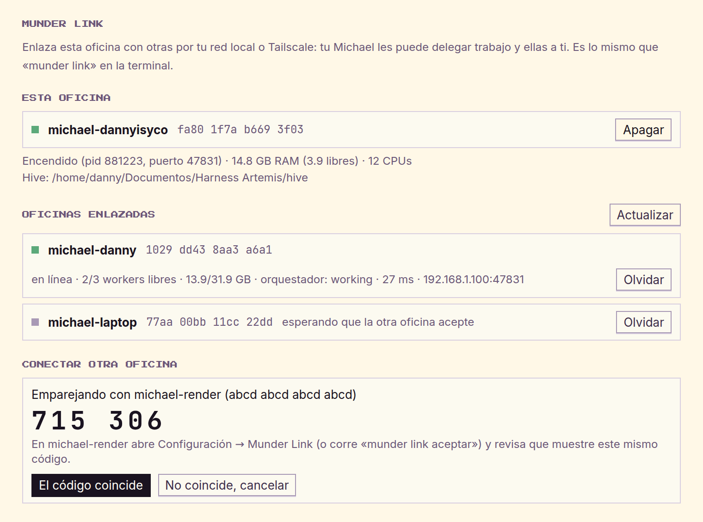
</p>

### 13. Guardia del hive + piso de versión de Claude Code
- **Guardia del hive:** un hook `PreToolUse` niega los `Write/Edit/MultiEdit/NotebookEdit` fuera de lo que le toca a cada agente: su `memory.md`, su inbox/outbox y `tasks.json`; el GOD además `board.md` y `spawn-requests/`.
- **Piso de versión:** si pides un modelo más nuevo que tu Claude Code (Opus 5.5 pide 2.1.280+), arranca con el más nuevo que tu CLI soporta.

### 14. Office Packs
Plantillas `core` más cinco giros. Las de packs importados limitan a «pedir permiso» todo lo que envía, publica, paga o borra.

### 15. Documentos para los agentes
- La base de conocimiento convierte Word/Excel/PowerPoint/PDF fuera del proceso main, en vez de indexar bytes como texto.
- Si no puede leer un archivo, lo dice en lugar de guardar basura.
- Los agentes tienen `doc-text` para leerlos.

### 16. CI en Linux, Windows y macOS
Cada push compila y corre la suite en los tres sistemas. Encontró un bug real: en Windows, borrar un worktree podía seguir el junction de `node_modules` hasta el checkout principal. Hoy un test con un `must-survive.txt` lo vigila.

### 17. Munder Mobile: PWA + iOS nativo
- **PWA:** el daemon de Link sirve la app web en `/app` y su API sellada en `/remote/v1/*`, en `tools/munder/lib-remote.cjs`.
- **Emparejamiento commit-reveal:** el nonce del celular va comprometido antes de ver el de la oficina, así nadie en medio puede probar nonces hasta que coincidan los códigos.
- **Llamadas:** ChaCha20-Poly1305 bajo X25519 + HKDF, con hora y anti-replay.
- **Criptografía de la PWA:** va en JS puro (`remote-app/remote-crypto.js`) porque el navegador no da WebCrypto por `http://`. Los tests la comparan byte a byte con Node.
- **App iOS nativa:** `ios/MunderMobile/` implementa el mismo protocolo `munder-remote@1` en SwiftUI, guarda las llaves en el Keychain y prueba las direcciones LAN/Tailscale de la oficina.
- **Generado y verificado:** `scripts/make-assets.cjs` produce retratos, icono, vectores y fixtures; el CI falla si quedan viejos y los tests del simulador comparan los bytes con la oficina.
- **Capturas reales:** el job `Simulator screenshots (demo office)` publica las pantallas en el artifact y las copias de referencia quedan en `docs/isyco/mobile/ios/`.
- **Dónde viven los celulares:** en `remotes.json`, nunca en `peers.json`.
- **Operaciones:** `overview`, `peers`, `answer` (igual que ASK ME), `ask` y `delegate`.

### 18. Munder Reviver (plano de mantenimiento)
- **Independiente:** `tools/munder/lib-reviver.cjs` usa solo builtins de Node y tiene su propia llave y sus propios clientes. No necesita a Munder, Link, el hive ni Electron.
- **Sano = cuatro pruebas:** el proceso del destino configurado, `/salud` con el token de ese arranque, el mismo pid y el `office_id` fijado. Para eso `/salud` ahora dice `pid`, `version` y `office_id`.
- **Sin shell:** solo `status`, `start`, `restart` y `stop`. El destino vive en `config.json`.
- **Protocolo:** Ed25519 en los dos sentidos, con nonce de un solo uso, ±60 s de hora y la petición atada al reviver y a la oficina.
- **Para solo lo que es suyo:**
  - fuerza únicamente al proceso principal y a sus helpers `--type=`;
  - nunca toca el daemon de Link, la terminal de un humano ni un `opencode` ajeno;
  - ante la duda, falla cerrado.
- **Watchdog acotado:** 3 intentos en 10 min, con espera entre ellos, y luego un estado `failed`. Distingue un cierre limpio de una caída.
- **Instalación:** systemd `--user` con `KillMode=process`; en Windows, tarea al iniciar sesión con `RestartOnFailure`.
- **ChatGPT:** un conector MCP aparte (`reviver-mcp.cjs`, `chatgpt-tunnel.sh --reviver`) con el mismo filtro de red que `munder-chatgpt-link`.

</details>

## Garantías de este fork

* **Nada va al upstream.** El remoto es `fork=DannyBaanks/munder-difflin`.
* **Sin llaves en el repo.** Solo hay placeholders (`xoxb-...`) en docs y comentarios.
* **`avatar-engine.cjs` no se edita a mano.** Se genera desde `portraitArt.ts` con `node tools/munder/sync-avatar-engine.cjs`, y la suite verifica su hash.
* **Tests:**
  * `npm run test:focused` (los mismos en los tres sistemas)
  * `node --test tools/munder/link.test.cjs tools/munder/remote.test.cjs tools/munder/avatar.test.cjs tools/munder/reviver.test.cjs`
  * `npm run typecheck`
* **Gate de release:** `node tools/check-release-links.cjs --live` comprueba que cada descarga anunciada exista de verdad.

## Licencia

El código es **MIT**; ver [`LICENSE`](./LICENSE).

El pixel-art de la oficina, incluido el banner de arriba, usa *Modern Interiors - RPG Tileset [16X16]* de [LimeZu](https://limezu.itch.io/moderninteriors). Tiene licencia Complete Version con crédito obligatorio y no está cubierto por el MIT; ver [`LICENSE-ASSETS`](./LICENSE-ASSETS). Los personajes son procedurales y propios del proyecto.

Parodia afectuosa, sin afiliación con NBC, *The Office* ni Dunder Mifflin.
